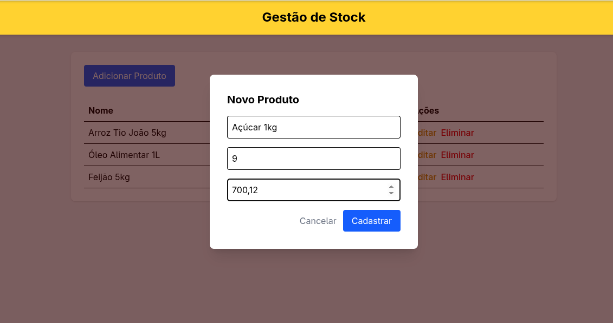
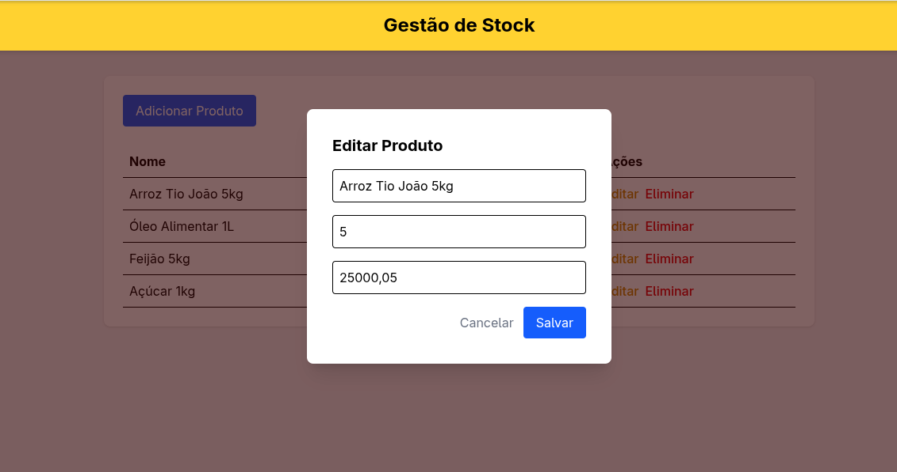
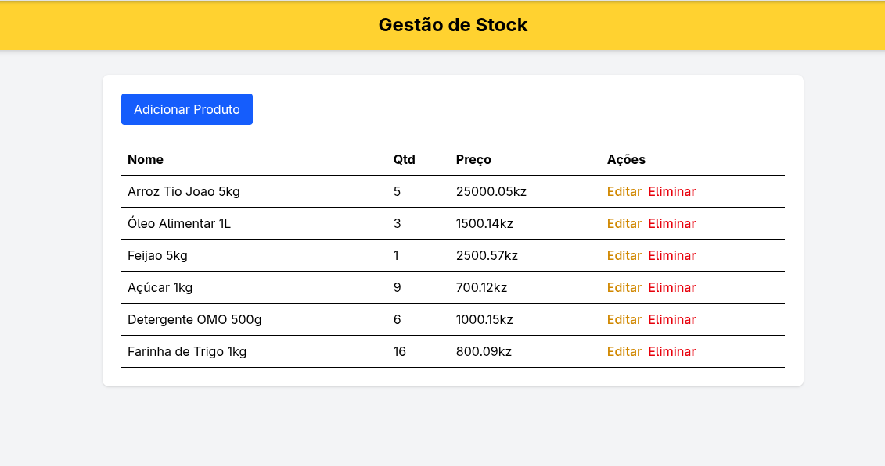

<h1 align="center">
     Mini CRUD
</h1>

<h2 align="center">
     CRUD - React Typescript + Tailwindcss + Supabase 
</h2>

<h3 align="center">
     Tela de Cadastro de Produto 
</h3>

<h3 align="center">
     Tela de Edição do Produto 
</h3>

<h3 align="center">
     Tela de Stock de Produto 
</h3>

